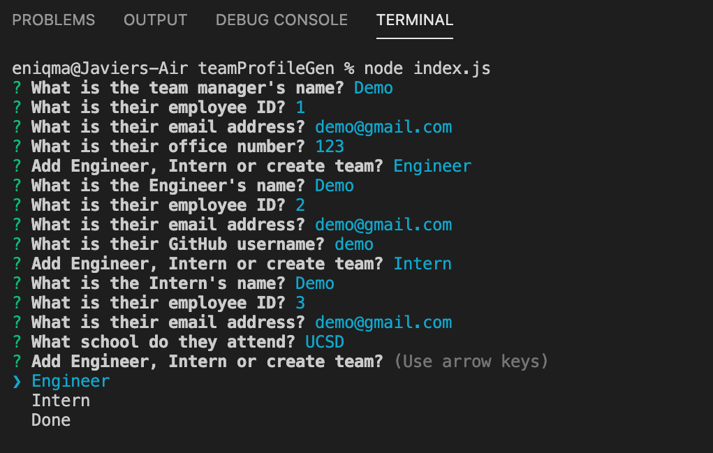
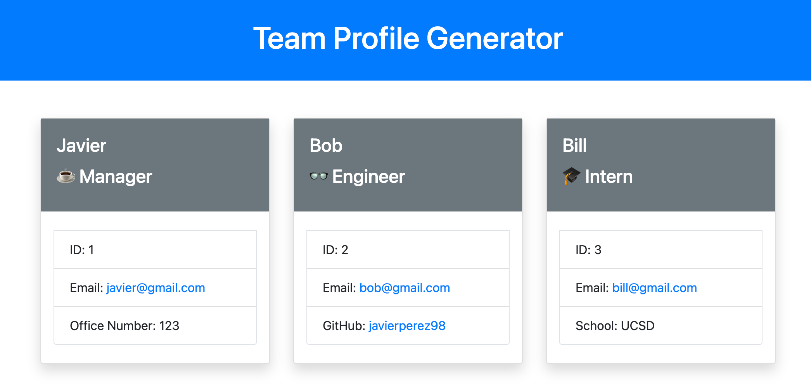

# Team Builder


## Description

<!-- Provide a short description explaining the what, why, and how of your project.
What was your motivation? Why did you build this project? What problem does it solve? What did you learn? -->

Team Builder is an application that lets you create an HTML file of your Development Team. The roles provided are a Team Manager, Team Interns and Team Engineers. This makes for a great addition to any group projects giving you a professional Team page with member names, roles and contact info. I learned who to implement my new understanding of classes and contructors to create a new and clean application.

## Table of Contents

- [Installation](#installation)
- [Usage](#usage)
- [Credits](#credits)
- [License](#license)
- [Tests](#tests)
- [Questions](#questions)

## Installation

<!-- What are the steps required to install your project? Provide a step-by-step description of how to get the development environment running. -->

```md
To install type the following command in your Terminal (MAC Users) or Bash (PC Users):

SSH Key: git clone git@github.com:javierperez98/teamProfileGen.git
HTTPS Key: git clone https://github.com/javierperez98/teamProfileGen.git
```

## Usage

<!-- Provide instructions and examples for use. Include screenshots as needed. -->

- The usages of this app is to provide you an easy an effortless Team HTML page for any project you may have.
- The Team page templete follows the layout of what a professional Team page should contain.
- This is what the app looks when you run it. Answer all the questions to create a html file.
  
- This is what the file will create.
  
- Link for video demo
- https://drive.google.com/file/d/1WME21wrlHdN4iKp1kqSe6y6p1yFAfXif/view?usp=sharing

## Credits

<!-- List your collaborators, if any, with links to their GitHub profiles. Links to websites or resources. -->

- https://www.google.com
- https://shields.io/
- https://nodejs.org/en/docs/
- https://choosealicense.com/
- https://www.contributor-covenant.org/
- https://developer.mozilla.org/en-US/
- https://w3schools.com
- [Christian Payan](https://github.com/ChrisPayan)

## License

<!-- If you need help choosing a license, refer to https://choosealicense.com/ -->

MIT License

Copyright (c) 2021 Javier Perez

Permission is hereby granted, free of charge, to any person obtaining a copy
of this software and associated documentation files (the "Software"), to deal
in the Software without restriction, including without limitation the rights
to use, copy, modify, merge, publish, distribute, sublicense, and/or sell
copies of the Software, and to permit persons to whom the Software is
furnished to do so, subject to the following conditions:

The above copyright notice and this permission notice shall be included in all
copies or substantial portions of the Software.

THE SOFTWARE IS PROVIDED "AS IS", WITHOUT WARRANTY OF ANY KIND, EXPRESS OR
IMPLIED, INCLUDING BUT NOT LIMITED TO THE WARRANTIES OF MERCHANTABILITY,
FITNESS FOR A PARTICULAR PURPOSE AND NONINFRINGEMENT. IN NO EVENT SHALL THE
AUTHORS OR COPYRIGHT HOLDERS BE LIABLE FOR ANY CLAIM, DAMAGES OR OTHER
LIABILITY, WHETHER IN AN ACTION OF CONTRACT, TORT OR OTHERWISE, ARISING FROM,
OUT OF OR IN CONNECTION WITH THE SOFTWARE OR THE USE OR OTHER DEALINGS IN THE
SOFTWARE.

## Tests

<!-- If your project has any tests provide examples on how to run them here. -->

```md
To run tests open index.js in your Terminal/Bash and type the following command to run the test files:

npm test
```

## Questions

- Contact me for any questions you might have.
- GitHub: [javierperez98](https://github.com/javierperez98)
- Email: javier21perez98@gmail.com
